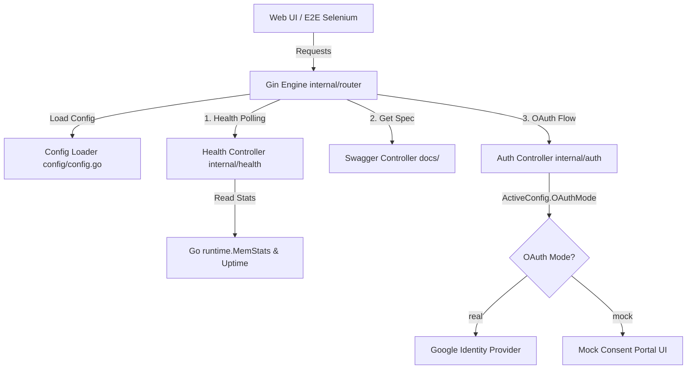
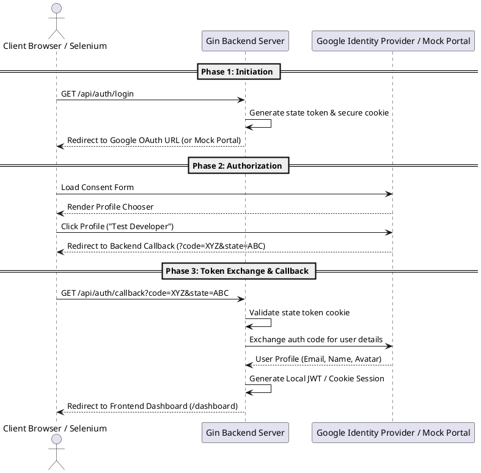
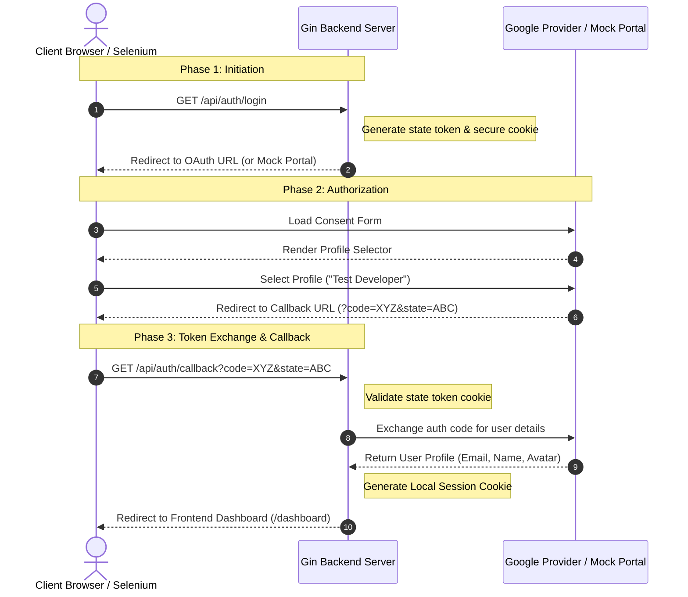

# Backend High & Low-Level Design Document

This document provides a comprehensive high-level and low-level architecture design of the **Antigravity Go Gin Backend**. It details the structural components, data telemetry services, dynamic configurations, and the authentication mechanisms (specifically focusing on Google OAuth and Mock OAuth integration).

---

## 1. High-Level System Architecture

The Go backend acts as a highly-efficient, REST-compliant API engine powered by `gin-gonic/gin`. It provides three key categories of services:
1. **System Telemetry & Monitoring**: Polled dynamically by clients to gauge performance.
2. **Dynamic Swagger Documentation**: Auto-rendered API specs generated dynamically based on active environment parameters.
3. **Session Authentication & Identity Management**: Integrates both real Google OAuth endpoints and mock user logins for testing.

### System Architecture Flow (Mermaid)

---

## 2. Low-Level Component Design

### 2.1 Configuration Loader (`backend/config/`)
- **Purpose**: Manage environment configurations dynamically without code recompilation.
- **Files**:
  - `config.json` templates for `local`, `dev`, `tst`, and `prd`.
  - `config.go`: Defines the `AppConfig` schema and environment-based loaders via `os.Getenv("APP_ENV")`.
- **Properties Defined**: Server port, OAuth Client IDs, callback URLs, active environment flags, and Swagger server host paths.

### 2.2 Health Check & Telemetry (`backend/internal/health/`)
- **Purpose**: Collect system-level metrics and child dependency status.
- **Metrics Collected**:
  - `Uptime`: Duration since application bootstrap.
  - `AllocatedMemory`: Active heap allocation.
  - `TotalAllocatedMemory`: Total memory allocated since runtime started.
  - `NumGC`: Garbage collection cycles.
  - `DatabaseConnection`: Simulated downstream health checks.

### 2.3 Modular Routing & Dynamic Swagger (`backend/internal/router/`)
- **Purpose**: Map Gin endpoints, handle Cross-Origin Resource Sharing (CORS), and intercept Swagger specification configurations at runtime.
- **Dynamic Swagger Strategy**:
  - At startup, the API is compiled using Swag CLI.
  - During server execution, the Swagger middleware reads `ActiveConfig` from the configuration module.
  - The middleware dynamically rewrites Swagger variables (e.g. host domain, URL schemes, description titles) based on whether the server runs in `local`, `dev`, `tst`, or `prd`.

---

## 3. Google OAuth & Mock Consent Flow

To support reliable local testing and automated E2E Selenium verification, the system runs a hybrid OAuth setup:
- **`OAUTH_MODE=real`**: Interfaces directly with Google's authenticating servers.
- **`OAUTH_MODE=mock`**: Serves a styled web interface containing pre-approved profiles that simulates Google's flow, bypassing authentication CAPTCHAs.

### OAuth Flow Diagram

#### PlantUML Specification
To render or view this flow in PlantUML engines, use the following schema:

#### Mermaid Sequence Diagram

---

## 4. Key Low-Level API Specifications

| Endpoint | Method | Authentication | Response Body | Description |
| :--- | :--- | :--- | :--- | :--- |
| `/health` | `GET` | None | `health.HealthResponse` | Evaluates server resource metrics, uptime, and state. |
| `/api/auth/login` | `GET` | None | Redirect Header | Initiates OAuth flow, setting local state cookies. |
| `/api/auth/callback`| `GET` | State Cookie | Redirect Header | Validates OAuth responses, exchanges codes, sets user session. |
| `/api/auth/user` | `GET` | Session Cookie | `auth.UserInfo` | Retrieves active authenticated user details. |
| `/api/auth/logout` | `POST` | None | `{"status":"success"}` | Invalidates session cookies and logs out user. |
| `/swagger/*any` | `GET` | None | HTML/JSON | Interactive dynamic API documentation portal. |
